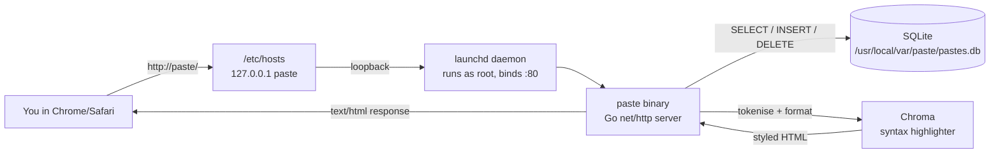
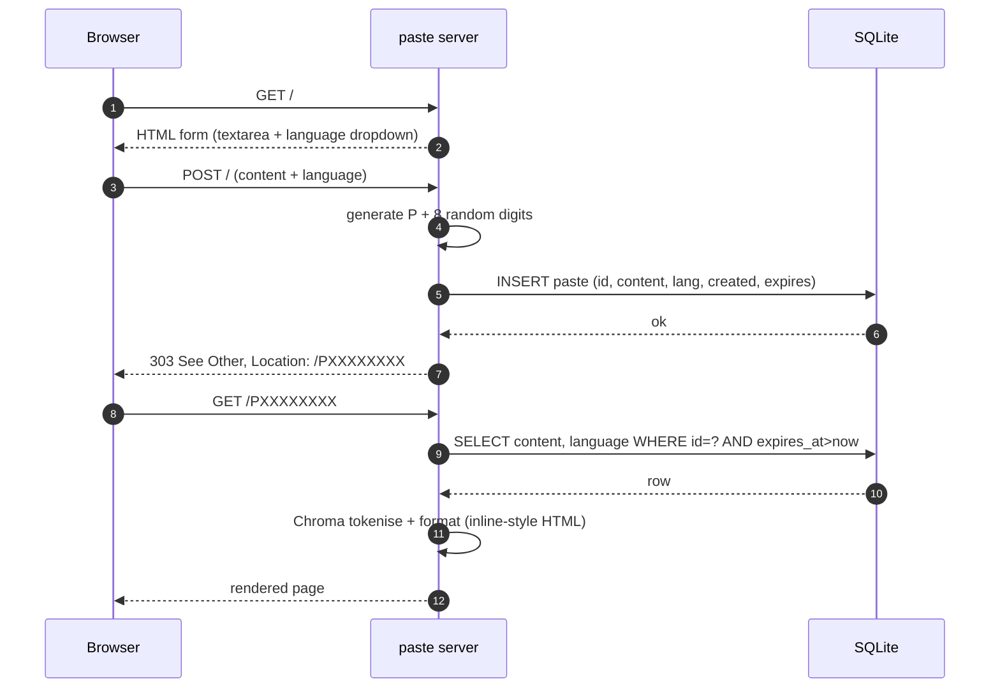

# gopaste

A self-hosted pastebin that runs entirely on your laptop. Open the browser, type `paste/`, drop text in a textarea, get back a short URL like `P74829301` that renders your content with syntax highlighting. Pastes auto-expire after 30 days.

Same idea as [Pastebin](https://pastebin.com), [GitHub Gist](https://gist.github.com), [hastebin](https://hastebin.com), or [dpaste](https://dpaste.com) — minus the network. Useful when you want a quick shareable-looking link for code/logs that never leaves your machine.

- Single Go binary (CGO-free, ~20MB)
- SQLite storage (pure-Go driver)
- Syntax highlighting via [Chroma](https://github.com/alecthomas/chroma)
- Runs as a macOS LaunchDaemon so it survives reboots
- No external network, no auth, bound to loopback

## Architecture



## Create-paste flow



## Routes

| method | path | purpose |
|---|---|---|
| `GET`  | `/`          | form to create a paste |
| `POST` | `/`          | create paste (form-encoded *or* raw body) |
| `GET`  | `/list`      | recent pastes (id, language, preview, lines, created, expires, delete) |
| `GET`  | `/P{id}`     | view paste with syntax highlighting |
| `GET`  | `/P{id}/raw` | raw `text/plain` — handy for `curl` |
| `POST` | `/P{id}/delete` | delete (used by the red link on list/view pages) |
| `DELETE` | `/P{id}`   | delete via `curl -X DELETE` |
| `GET`  | `/healthz`   | returns `ok` |

## CLI usage

```bash
# pipe anything to paste → prints the URL
cat script.py | curl --data-binary @- http://paste/

# paste the macOS clipboard
pbpaste | curl --data-binary @- http://paste/

# fetch a paste as raw text
curl http://paste/P12345678/raw

# delete one
curl -X DELETE http://paste/P12345678
```

## Install (macOS)

```bash
git clone https://github.com/rishabhxpandey/gopaste.git
cd gopaste

sudo make install   # compiles, copies to /usr/local/bin, installs LaunchDaemon
sudo make hosts     # adds "127.0.0.1 paste" to /etc/hosts
sudo dscacheutil -flushcache && sudo killall -HUP mDNSResponder

# verify
curl http://paste/healthz     # → ok
open http://paste/
```

### Reaching it from the browser

Chrome/Safari treat bare single words as search. Three ways to navigate:

1. Type **`paste/`** (with trailing slash) — always works.
2. Type **`paste`** + **⌘+Enter** — Chrome appends `http://`.
3. After a few visits, the omnibox learns the host and plain `paste` works.

## Configuration

| flag      | default                                | meaning |
|-----------|----------------------------------------|---------|
| `-addr`   | `:80`                                  | listen address |
| `-db`     | `/usr/local/var/paste/pastes.db`       | sqlite path |

TTL is hardcoded to 30 days (`ttl` constant in [main.go](main.go)). A background ticker prunes expired rows every hour, and also runs once at startup.

## Makefile targets

| target            | what it does |
|-------------------|--------------|
| `make build`      | compile `paste` binary |
| `sudo make install`   | build + copy + install LaunchDaemon + start it |
| `sudo make hosts`     | append `127.0.0.1 paste` to `/etc/hosts` (idempotent) |
| `sudo make reload`    | restart the LaunchDaemon after a rebuild |
| `sudo make uninstall` | stop daemon, remove plist + binary (keeps the db) |
| `make logs`       | `tail -F /usr/local/var/log/paste.log` |
| `make status`     | print daemon state / pid |

## Layout

```
paste/
├── main.go              # HTTP server, routes, SQLite, ID gen, pruner
├── templates.go         # embedded HTML (form + view + list)
├── launchd/
│   └── com.rishabh.paste.plist   # LaunchDaemon, runs as root on :80
├── Makefile
├── go.mod / go.sum
└── README.md
```

## What this deliberately excludes

- No auth. Bound to loopback, so only your machine can reach it.
- No file uploads, no markdown mode, no edit flow.
- No TLS. Localhost-only; adding certs would be ceremony without payoff.
- No sync across machines. The db lives on one laptop.

## License

MIT — do whatever you like.
